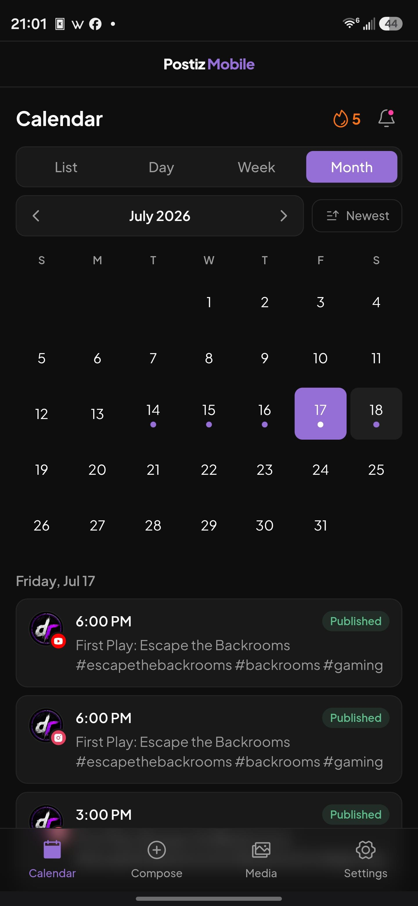
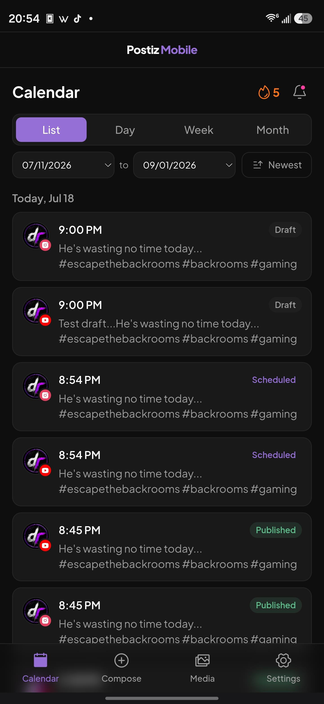
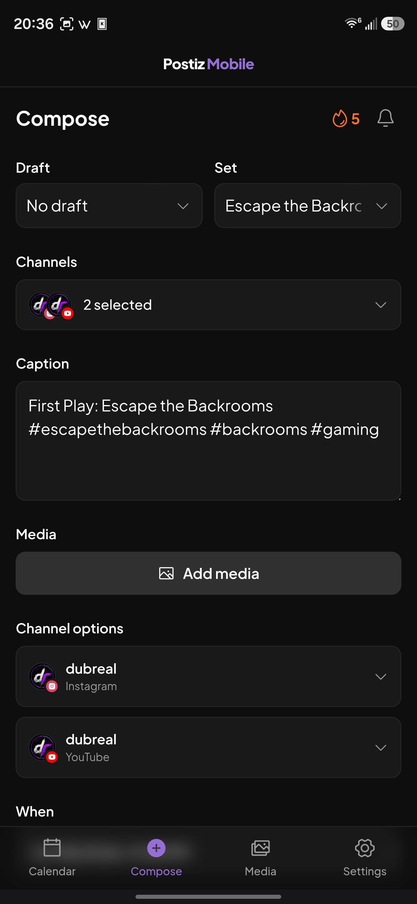
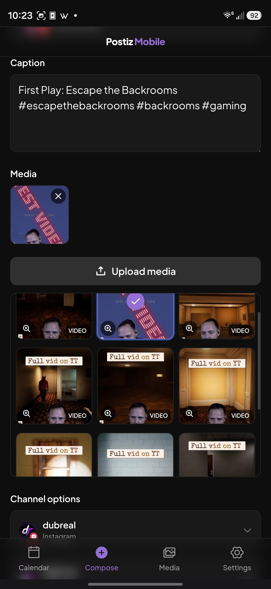
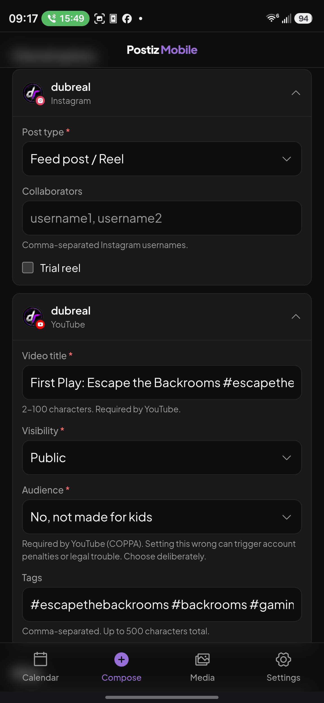
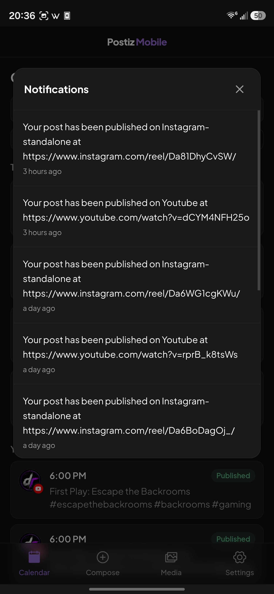
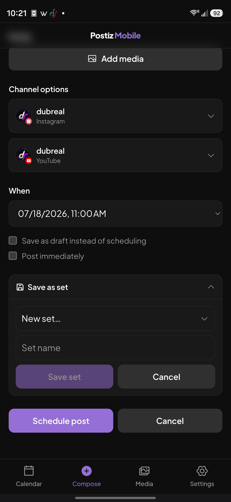
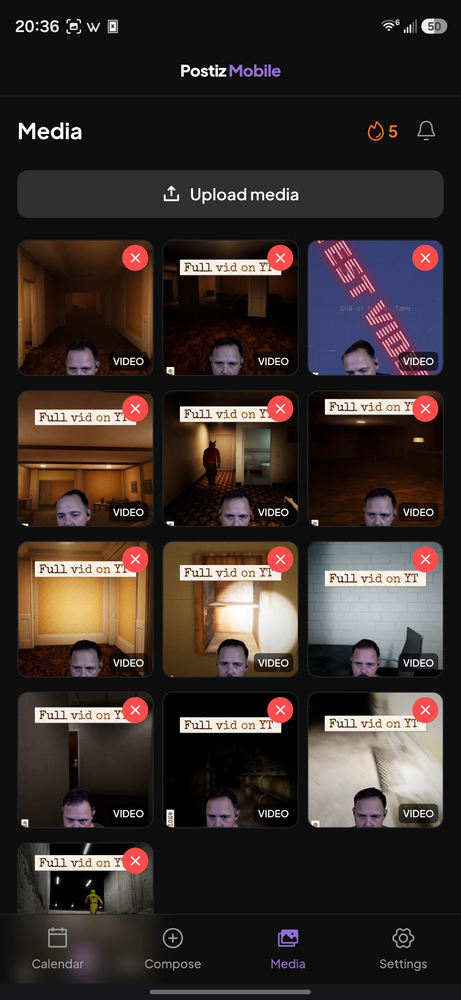
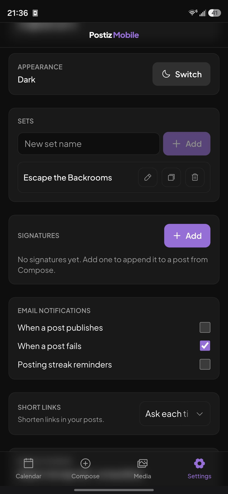

# postiz-mobile

[](LICENSE)
[](https://github.com/gitroomhq/postiz-app)
[](https://github.com/gitroomhq/postiz-app/releases/tag/v2.21.9)
[](CONTRIBUTING.md)

A **mobile-first web interface for a self-hosted [Postiz](https://github.com/gitroomhq/postiz-app)**.
Postiz has no mobile app and its desktop UI is not responsive
([#740](https://github.com/gitroomhq/postiz-app/issues/740),
[#1008](https://github.com/gitroomhq/postiz-app/issues/1008)). This is a small,
separate front end you run alongside your existing Postiz so you can upload
media, view your calendar, and schedule posts from a phone.

It changes **nothing** in Postiz. It adds no accounts and stores no credentials.
It is a static app plus a thin reverse proxy.

> **Provided as-is, no warranty.** This is an independent project, not affiliated
> with Postiz. It talks to Postiz's private HTTP API, which can change between
> Postiz versions. It may not work on your setup. Read the
> [Security](#security) section before deploying.
>
> **Tested on one configuration only.** postiz-mobile has been run and confirmed
> working against **Postiz v2.21.9** with **Cloudflare R2** object storage, served
> from a subdomain of the same registrable domain as the Postiz instance. It has
> **not** been confirmed on other Postiz versions, other storage backends
> (`local` disk, AWS S3, MinIO), or other domain layouts. It may work on yours,
> but that is unverified. Please try it and
> [open an issue](https://github.com/dubreal/postiz-mobile/issues) with your setup
> and what happened. See [Project status](#project-status).

---

## Screenshots

<p>
  
  
  
  
  
  
  
  
  
</p>

_Calendar (month and list) with the posting-streak and notifications indicators; Compose with the channel picker, media picker, per-channel options, and save-as-set; the notifications modal; the Media library; and Settings._

---

## What it does

- **Log in** with your existing Postiz account (email + password).
- **Calendar** - see scheduled, published, draft, and failed posts grouped by day.
- **Compose** - pick channels from a searchable picker, write a caption, attach
  media, set per-channel options, then schedule, save a draft, or post
  immediately.
  - **Per-channel options** mirror the Postiz desktop panels: YouTube title,
    visibility, **audience (made-for-kids)**, and tags; TikTok privacy, posting
    method, and interaction toggles; Instagram post type and collaborators;
    Discord channel. Cards with a required-but-unset field auto-expand.
  - **Post now** publishes immediately (distinct button color); the post still
    lands in the calendar.
  - **Sets** - apply a saved Set, save the current post as a new Set, or override
    an existing one. **Drafts** - load a saved draft to continue, or delete it.
- **Sets management** (Settings) - add, rename, duplicate, and delete Sets.
- **Media** - browse your Postiz media library and upload photos/videos from your phone.

It does not reimplement Postiz features it does not need. Anything not listed
above, do on the desktop.

## How it works

```
Phone ──https──► m.example.com          (your reverse proxy / tunnel)
                    │
        postiz-mobile (Caddy):
          /          → static SPA
          /api/*     → reverse_proxy to your Postiz   (same origin)
          /uploads/* → reverse_proxy to your Postiz
                    │
        Your Postiz (unchanged)
                    │
Phone ──uploads──► your object storage (only in 'cloudflare' storage mode)
```

Because the app and the proxied `/api` live on the **same origin**, your browser
sends Postiz's own login cookie automatically. postiz-mobile calls the same API
your Postiz desktop uses. There is no second login and no API key.

### Requirement: same registrable domain

Postiz sets its auth cookie for your registrable domain (e.g. `.example.com`).
**postiz-mobile must be served from a subdomain of the same registrable domain as
your Postiz.** For example:

| Your Postiz | postiz-mobile |
|---|---|
| `postiz.example.com` | `m.example.com` ✅ |
| `social.acme.io` | `mobile.acme.io` ✅ |
| `postiz.example.com` | `example.net` ❌ (different domain - login cookie won't apply) |

## Prerequisites

You need these before you start. The steps below assume a **typical Postiz
v2.21.9 install** (the version this app is built and tested against) that is
already up and running.

- **A running self-hosted Postiz v2.21.9 that you administer.** Install it first
  via the [official Postiz docs](https://docs.postiz.com) /
  [Postiz repo](https://github.com/gitroomhq/postiz-app) and confirm you can log
  in on the desktop. postiz-mobile does **not** install Postiz and does not work
  without it. If your Postiz is a different version, expect to test and possibly
  adjust (see [Compatibility](#compatibility)).
- **Docker and Docker Compose** on the same host (or a host that can reach your
  Postiz over the network).
- **A reverse proxy or tunnel** you already use to expose services over HTTPS
  (Cloudflare Tunnel, nginx, Traefik, Caddy, etc.). postiz-mobile binds to
  loopback and expects to be fronted by this.
- **A spare subdomain on the SAME registrable domain as your Postiz** (see
  [Requirement: same registrable domain](#requirement-same-registrable-domain)).
- **Know two things about your Postiz:**
  1. Its `STORAGE_PROVIDER` (`local` or `cloudflare`) - check your Postiz `.env`.
     Yours **must** match.
  2. The address the app's container can reach Postiz at (host + port). In a
     typical single-host Docker install, Postiz's frontend listens on the host
     (often `:4000` or whatever you mapped), reachable from another container as
     `http://host.docker.internal:<port>`.

## Deploy

1. **Get the code and configure**
   ```bash
   git clone https://github.com/dubreal/postiz-mobile.git
   cd postiz-mobile
   cp .env.example .env
   ```
   Edit `.env` (none of these are secrets):
   - `POSTIZ_UPSTREAM` - where Postiz is reachable **from inside this container**.
     For a Postiz on the same Docker host, use
     `http://host.docker.internal:<postiz-port>` (the `extra_hosts` mapping in
     `docker-compose.yml` makes `host.docker.internal` resolve on Linux). If your
     Postiz runs as a container on a shared Docker network, point this at that
     container name instead (e.g. `http://postiz:5000`) and see the comment in
     `docker-compose.yml` about removing `extra_hosts`.
   - `STORAGE_PROVIDER` - **must match your Postiz** `STORAGE_PROVIDER`
     (`local` or `cloudflare`).
   - `MEDIA_ORIGIN` - **only** if `cloudflare`: the public READ origin of your
     object store (e.g. `https://media.example.com`), so previews load. Leave
     empty for `local`.
   - `UPLOAD_ORIGIN` - **only** if `cloudflare`: the S3 API endpoint the browser
     uploads to. For Cloudflare R2 keep the wildcard default; for AWS S3 use
     `https://s3.<region>.amazonaws.com`; for MinIO your endpoint. Leave empty for
     `local` (uploads then stream through the proxy - see [Security](#security)).
   - `HOST_PORT` - loopback port your reverse proxy forwards to (default `4008`).

2. **Build and run**
   ```bash
   docker compose up -d --build
   ```
   It listens on `127.0.0.1:${HOST_PORT}`.

3. **Point a subdomain at it** (same registrable domain as your Postiz). Route
   `m.example.com` → `127.0.0.1:${HOST_PORT}` via your existing reverse proxy or
   tunnel (Cloudflare Tunnel, nginx, Traefik, etc.). Terminate HTTPS there.

4. **Object storage only (`STORAGE_PROVIDER=cloudflare`):** add your
   postiz-mobile origin to your bucket's CORS `AllowedOrigins`, so the browser
   can upload directly to storage. Example CORS entry:
   ```json
   { "AllowedOrigins": ["https://m.example.com"],
     "AllowedMethods": ["GET", "PUT"],
     "AllowedHeaders": ["*"],
     "ExposeHeaders": ["ETag"] }
   ```
   `local`-storage instances skip this step.

5. Open `https://m.example.com` on your phone and log in. Add to Home Screen for
   an app-like icon.

## Security

Read this before you deploy. The trust model is stated plainly.

- **This app never stores your password or session token.** The login form hands
  your password straight to Postiz's `/api/auth/login` over HTTPS and discards it;
  Postiz returns an `httpOnly` cookie that only your browser and your Postiz see.
  The app's JavaScript cannot read that cookie.
- **The proxy sees login traffic in transit.** Like any reverse proxy in front of
  any login (including Postiz's own), the Caddy process passes the request bytes
  through while forwarding them to Postiz. It does not parse, log, or store them.
  **Run postiz-mobile on infrastructure you control** - it sits in the auth path.
- **Postiz has no two-factor auth.** Login is single-factor, the same as the
  Postiz desktop. If you want a second factor, put an authenticating proxy
  (e.g. Cloudflare Access) in front of `m.example.com`.
- **Postiz session tokens do not expire.** A leaked session cookie stays valid
  until you change your Postiz password. Serve over HTTPS only, and sign out on
  shared devices. Sign-out clears the cookie server-side.
- **Serve over HTTPS only.** The app assumes a secure context (uploads, cookies).
- **No login rate-limiting is added here.** postiz-mobile does not throttle login
  attempts, and Postiz's own brute-force protection is minimal with no 2FA. For a
  publicly reachable deployment, put an authenticating or rate-limiting layer in
  front of it (Cloudflare Access, fail2ban, or your reverse proxy's rate limits).
- **`local` storage mode streams uploads through the proxy.** When
  `STORAGE_PROVIDER=local`, media is uploaded via the Caddy proxy, which allows a
  request body up to **2 GB**. A large or abusive upload consumes proxy/host
  memory and bandwidth (a DoS surface on the operator). In `cloudflare` mode the
  browser uploads **directly to your object store**, bypassing the proxy, so this
  does not apply. If you run `local` mode on a public host, cap upload size at
  your reverse proxy and/or restrict who can reach the app.
- **No secrets live in this repo or image.** postiz-mobile holds no API keys and
  no credentials. `.env` contains only non-secret settings (URLs, a storage-mode
  flag) and is git-ignored.

## Media format limitations (important)

This is inherited from Postiz and the social platforms, not specific to
postiz-mobile, but it surfaces here so it is worth knowing:

- **Postiz accepts `.mp4` video and common image types only.** Uploads are size
  limited to **1 GB video / 30 MB image**. postiz-mobile enforces these and warns
  before uploading.
- **HEVC / H.265 video (and 8K/4K clips) may look "broken."** A phone that records
  in HEVC (Samsung "High efficiency", iPhone default, most 8K modes) produces a
  valid `.mp4` that the phone plays fine, but **desktop browsers cannot decode
  HEVC**, so the Postiz desktop preview shows no thumbnail and will not play it.
  Some platforms (notably Instagram) also reject or heavily downscale HEVC/8K.
  The file uploaded correctly; it is a codec/resolution issue, not a failure.
- **For dependable posting, record clips as H.264 at 1080p (or 4K).** On Samsung:
  Camera → Settings → Advanced video options → Video codec → "H.264 / More
  compatible" (note: 8K only records in HEVC, so drop to 4K/1080p). On iPhone:
  Settings → Camera → Formats → "Most Compatible".
- postiz-mobile cannot reliably detect HEVC from the uploading phone (the phone
  decodes it natively), so it warns on high resolution as the best available
  signal. Treat a missing desktop preview as a codec hint, not a bug.

## Compatibility

Tested against **Postiz v2.21.9**. It relies on Postiz's private API
(`/api/auth/login`, `/api/user/self`, `/api/user/logout`, `/api/media`) and
public API (`/api/public/v1/*`). These can change across Postiz releases; pin a
Postiz version you have tested, and expect to update after major Postiz upgrades.

Per-provider compose settings are implemented for YouTube, TikTok, Instagram, and
Discord. Other providers can be selected but may need fields this app does not yet
expose; use the desktop for those.

## Project status

Early. Built for one operator's setup and shared so others can try it and report
back.

- **Confirmed working:** Postiz v2.21.9, Cloudflare R2 storage, served from a
  sibling subdomain of the Postiz instance.
- **Unverified:** other Postiz versions, `local` / AWS S3 / MinIO storage, and
  other domain layouts. It is reasoned to work but not tested. Treat it as beta on
  your setup.
- **It will not modify or break your Postiz.** postiz-mobile is a separate
  container that only calls Postiz's HTTP API with your own login - the same calls
  the Postiz desktop makes. It never touches Postiz's database, files, containers,
  or config. Every delete (post, media, set) is behind a confirmation, and nothing
  destructive runs on its own. On an unsupported setup a call may simply fail and
  show an error; your Postiz data is not at risk.
- **Please report issues:** include your Postiz version, storage provider, how you
  serve it (reverse proxy / tunnel + domain layout), and what broke.
  [Open an issue](https://github.com/dubreal/postiz-mobile/issues).

## Development

```bash
npm install
POSTIZ_UPSTREAM=https://your-postiz.example.com npm run dev   # proxies /api during dev
npm run build        # production build to dist/
npm run typecheck
```

Note: the same-registrable-domain cookie rule means auth only fully works when
served from a sibling subdomain of your Postiz; local `npm run dev` can reach the
API but the browser may not retain the cross-site cookie.

## License & attribution

**AGPL-3.0.** See [LICENSE](./LICENSE).

postiz-mobile is a companion for [Postiz](https://github.com/gitroomhq/postiz-app)
and is built from it: the design tokens (`src/styles/postiz-colors.scss`,
`tailwind.tokens.cjs`) are copied from Postiz, and the upload client
(`src/lib/upload.ts`) is ported from Postiz's own uploader. Postiz is licensed
AGPL-3.0, so this project is too. Not affiliated with or endorsed by Postiz /
Gitroom.
